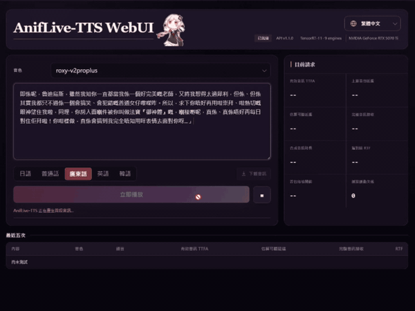

<div align="center">


# AnifLive-TTS

**面向粵語／廣東話的低延遲、高音質、多語言聲音複製 TTS 推理系統**

[](RELEASE_NOTES_v1.2.0.md)
[](https://docs.nvidia.com/deeplearning/tensorrt/)
[](https://developer.nvidia.com/cuda-toolkit)
[](https://github.com/RVC-Boss/GPT-SoVITS)
[](LICENSING.md)

**繁體中文** · [English](README.md) · [简体中文](README_ZH_CN.md)

</div>

## 關於項目

AnifLive-TTS 是 AnifEngine-Voice 的第一方 TTS，誕生於一個很實際的需求：在開發 AnifEngine-Voice 時，我一直找不到一個能同時滿足 **粵語／廣東話**、**低延遲**、**高音質**與可自託管、自主管理的 TTS 方案。😮‍💨

因此我選擇以 GPT-SoVITS 為基礎，深入改造其推理底層，將 **低延遲** 與 **高音質** 定為 AnifLive-TTS 的核心目標。🤓👆

v1 首發完整支援 V2ProPlus；未來版本將沿用相同 API 與模型封裝格式，逐步支援更多 GPT-SoVITS 模型世代。

## 核心能力

- 九個神經網路模型皆由 TensorRT 11 透過 `execute_async_v3()` 執行。
- 支援 普通話(`zh`)、粵語／廣東話(`yue`)、英語(`en`)、日語(`ja`)、韓語(`ko`)，並兼容 GPT-SoVITS 傳統 API 格式與 OpenAI API 格式。
- 支援 GPT-SoVITS V2ProPlus 聲音複製模型，可將自訂 GPT／SoVITS 模型檢查點與參考音訊封裝為獨立音色。
- 完整單聲道 PCM16 WAV 與低延遲 PCM16 串流共用同一套推理流程。
- v1 可用一條命令完成 V2ProPlus 模型檢查、ONNX 匯出、FP16 轉換、TensorRT 引擎建立、實際推理驗證及模型封裝。
- 推理服務啟動前完成模型與引擎準備，`serve` 熱路徑完全離線。

## 《無職轉生》洛琪希·米格路迪亞：V2ProPlus 粵語／廣東話演示

<div align="center">

<p><a href="assets/roxy-v2proplus-cantonese-demo.mp4"></a></p>

<p>點擊畫面即可播放有聲演示。WebUI 介面仍處於測試階段，尚未於此版本開放，敬請期待未來版本。</p>

</div>

## 實測性能

> [!NOTE]
> **環境：** RTX 5070 Ti 16 GB / NVIDIA 驅動程式 596.36 / CUDA 執行環境 12.8 / PyTorch
> 2.7.0+cu128 / TensorRT 11.2.1.2 / FP16

測試採用外部 Miku 與 Roxy V2ProPlus 音色套件，並固定短句、隨機種子與採樣參數。每個音色各測 10 輪，同一輪內交替測試兩個音色；每組模型輪次先預熱 10 次，再測 100 次完整 WAV、100 次新連線串流及 100 次持續連線串流。主值取全部 20 組模型輪次統計值的中位數，範圍反映各組之間的波動。

正式測試均為單併發。新連線數據會為每個請求建立本機 HTTP/1.1 連線；持續連線數據則在每輪重用一條已獨立預熱的連線。首包延遲從送出請求起計，直至用戶端讀取伺服器送出的第一個 PCM 音訊區塊。可聽 TTFA 取最早有效 10 ms 均方根分析幀內，第一個超過 -45 dBFS 的 PCM 取樣點，並受該音訊區塊的實際抵達時間約束；不包含播放裝置延遲。

| 指標 | 20 組模型輪次統計值的中位數 | 各組範圍 |
|---|---:|---:|
| 完整 REST WAV 端到端 P50 | **192.880 ms** | 169.381–227.030 ms |
| 完整 REST WAV 端到端 P95 | **230.750 ms** | 195.755–273.346 ms |
| 伺服器推理 P50 | **166.226 ms** | 139.831–201.973 ms |
| RTF P50 | **0.088774** | 0.071140–0.106101 |
| 串流首包延遲 P50 | **87.140 ms** | 79.405–92.391 ms |
| 串流首包延遲 P95 | **103.113 ms** | 87.924–122.153 ms |
| 持續連線串流首包延遲 P50 | **69.698 ms** | 63.808–72.610 ms |
| 持續連線串流首包延遲 P95 | **85.297 ms** | 76.910–99.756 ms |
| 串流有效音訊 TTFA P50 | **96.034 ms** | 88.759–101.671 ms |
| 串流有效音訊 TTFA P95 | **111.565 ms** | 98.174–128.778 ms |
| 持續連線串流有效音訊 TTFA P50 | **77.717 ms** | 71.789–82.833 ms |
| 持續連線串流有效音訊 TTFA P95 | **94.550 ms** | 86.578–110.006 ms |
| GPU 佔用率 P50 | **53.0%** | 46–56% |
| GPU 佔用率 P95 | **60.0%** | 58–62% |

全部 2,000 個完整 WAV、2,000 個新連線串流及 2,000 個持續連線串流請求均回報 `TensorRT-11`，且 `X-PyTorch-Fallback: false`。可機讀摘要見 [`benchmarks/README_BENCHMARK_SUMMARY.json`](benchmarks/README_BENCHMARK_SUMMARY.json)。

`nvidia-smi` 顯示的是取樣區間內的 GPU 佔用率，而非 SM 佔用率。在單併發下，序列化的 GPT 自回歸流程仍是 GPU 佔用率無法接近 100% 的主要原因。

### 重現性能表格

[`scripts/benchmark_readme.py`](scripts/benchmark_readme.py) 是公開性能測試的標準腳本。它輸出的 Markdown 表格與上表完全相同，只包含同樣的 14 個指標，並採用相同的測試內容與統計方法。

對已經運行的本機 API 執行：

```powershell
.\.venv\Scripts\python.exe .\scripts\benchmark_readme.py `
  --host 127.0.0.1 --port 9881 --locale zh-HK `
  --model miku-v2proplus `
  --model roxy-v2proplus `
  --report .\reports\benchmark.json `
  --markdown .\reports\benchmark.md
```

也可以直接在現有 Docker 容器內執行，不會重新建立或重建容器：

```powershell
docker exec aniflive-tts /app/scripts/entrypoint.sh benchmark `
  --host 127.0.0.1 --port 9880 --locale zh-HK `
  --model miku-v2proplus --model roxy-v2proplus `
  --report /data/reports/benchmark.json `
  --markdown /data/reports/benchmark.md
```

預設為每個音色執行 10 輪；每輪先預熱 10 次，再測 100 次完整 WAV、100 次新連線串流及 100 次持續連線串流。重複使用 `--model` 可合併多個音色套件的結果。所有測試均為單併發。

### GPT-SoVITS 性能數據對比

#### 首輸出延遲（越低越快）

| 專案／系統 | 指標 | 延遲 | 測試條件 | 來源 |
|---|---|---:|---|---|
| **AnifLive-TTS v1.2** | **可聽 TTFA P50** | **77.717 ms** 🚀 | **RTX 5070 Ti；HTTP/1.1 持續連線；20 組 Miku／Roxy 交錯模型輪次** | **[本機實測](benchmarks/README_BENCHMARK_SUMMARY.json)** |
| GPT-SoVITS C++ TRT 串流 | 首包 | 460 ms | RTX 2080 Ti 22 GB | [GPT-SoVITS C++](https://github.com/GPT-SoVITS-Devel/GPT-SoVITS-cpp#-performance-benchmarks) |
| GPT-SoVITS Minimal Inference ONNX 串流 | 首個 token | 1,000 ms | RTX 2080 Ti 22 GB；FP16 | [Minimal Inference](https://github.com/GPT-SoVITS-Devel/GPT-SoVITS_minimal_inference#-performance-benchmarks) |
| GPT-SoVITS Minimal Inference TRT 固定尺寸最佳化版 | 首個語意標記 | 2,022 ms | RTX 2080 Ti 22 GB；FP16 | [Minimal Inference](https://github.com/GPT-SoVITS-Devel/GPT-SoVITS_minimal_inference#-performance-benchmarks) |

#### RTF（越低越快）

| 專案／系統 | RTF | 後端 | 測試條件 | 來源 |
|---|---:|---|---|---|
| GPT-SoVITS V2ProPlus | 0.014 | PyTorch 平行推理 | RTX 4090；約 4 分鐘長文 | [RVC-Boss/GPT-SoVITS](https://github.com/RVC-Boss/GPT-SoVITS#features) |
| GPT-SoVITS V2ProPlus | 0.028 | PyTorch 平行推理 | RTX 4060 Ti | [RVC-Boss/GPT-SoVITS](https://github.com/RVC-Boss/GPT-SoVITS#features) |
| **AnifLive-TTS v1.2** | **0.088774** | **TensorRT 11 FP16** | **RTX 5070 Ti；20 組 Miku／Roxy 交錯模型輪次** | **[本機實測](benchmarks/README_BENCHMARK_SUMMARY.json)** |
| GPT-SoVITS C++ TRT | 0.1020 | TensorRT | RTX 2080 Ti 22 GB | [GPT-SoVITS C++](https://github.com/GPT-SoVITS-Devel/GPT-SoVITS-cpp#-performance-benchmarks) |
| GPT-SoVITS Minimal Inference TRT 固定尺寸最佳化版 | 0.2096 | TensorRT；針對固定尺寸最佳化 | RTX 2080 Ti 22 GB；FP16 | [Minimal Inference](https://github.com/GPT-SoVITS-Devel/GPT-SoVITS_minimal_inference#-performance-benchmarks) |

### 其他開源 TTS 的公開性能數據

以下並非同條件的受控基準測試。除 AnifLive-TTS 外，數據均由各來源自行公布；GPU、模型能力、輸入內容、首包大小、併發度及測量方法並不相同。表格只整理相同指標的公開數據，不代表同條件排名。

#### 首音訊延遲（越低越快）

| 系統 | 指標 | 延遲 | 統計口徑 | 測試條件 | 來源 |
|---|---|---:|---|---|---|
| **AnifLive-TTS v1.2** | **可聽 TTFA** | **77.717 ms** 🚀 | **P50** | **RTX 5070 Ti；HTTP/1.1 持續連線；20 組 Miku／Roxy 交錯模型輪次** | **[本機實測](benchmarks/README_BENCHMARK_SUMMARY.json)** |
| Qwen3-TTS-12Hz-0.6B | 首包延遲 | 97 ms | 單併發 | 單加速器；320 ms 語音包 | [Qwen3-TTS 技術報告](https://arxiv.org/abs/2601.15621) |
| Fish Audio S2 | TTFA | 約 100 ms | 專案發布值 | H200；單卡 | [Fish Audio S2](https://github.com/fishaudio/fish-speech#performance) |
| Chatterbox-Flash（D=32，α=0.75） | TTFP | 103 ms | 單併發；50 句 | H100 | [Chatterbox-Flash 論文](https://arxiv.org/abs/2605.30748) |
| Chatterbox-Flash（預設 D=16，α=0.5） | TTFP | 118 ms | 單併發；50 句 | H100 | [Chatterbox-Flash 論文](https://arxiv.org/abs/2605.30748) |
| CosyVoice2 | 首個區塊 | 196.13 ms | P50 | L20；單併發；用戶端／伺服器 | [QwenAudio/CosyVoice](https://github.com/QwenAudio/CosyVoice/blob/main/runtime/triton_trtllm/README.Cosyvoice2.DiT.md#benchmark-with-client-server-mode) |

IndexTTS 2.0／2.5 與 VoxCPM2 未提供同口徑的首音訊延遲數值。

#### RTF（越低越快）

| 系統 | RTF | 推理後端／模型 | 測試條件 | 來源 |
|---|---:|---|---|---|
| Chatterbox-Flash（D=32，α=0.75） | 0.076 | 區塊擴散 | H100；單併發；50 句 | [Chatterbox-Flash 論文](https://arxiv.org/abs/2605.30748) |
| **AnifLive-TTS v1.2** | **0.088774** | **TensorRT 11 FP16** | **RTX 5070 Ti；20 組 Miku／Roxy 交錯模型輪次** | **[本機實測](benchmarks/README_BENCHMARK_SUMMARY.json)** |
| Chatterbox-Flash（預設 D=16，α=0.5） | 0.107 | 區塊擴散 | H100；單併發；50 句 | [Chatterbox-Flash 論文](https://arxiv.org/abs/2605.30748) |
| CosyVoice3 | 0.1091 | TRT-LLM；離線批次 1 | L20 | [QwenAudio/CosyVoice](https://github.com/QwenAudio/CosyVoice/blob/main/runtime/triton_trtllm/README.Cosyvoice3.md#benchmark-with-offline-inference-mode) |
| CosyVoice2 | 0.1228 | TRT-LLM | L20；單併發；用戶端／伺服器 | [QwenAudio/CosyVoice](https://github.com/QwenAudio/CosyVoice/blob/main/runtime/triton_trtllm/README.Cosyvoice2.DiT.md#benchmark-with-client-server-mode) |
| VoxCPM2 | 約 0.13 | Nano-vLLM / vLLM-Omni | RTX 4090 | [OpenBMB/VoxCPM](https://github.com/OpenBMB/VoxCPM#-highlights) |
| Fish Audio S2 | 0.195 | SGLang 推理引擎 | H200；單卡 | [Fish Audio S2](https://github.com/fishaudio/fish-speech#performance) |
| IndexTTS 2.5 | 0.2065 | 2.5 BF16；KV 快取 | RTX 4090；整體 | [index-tts/index-tts](https://github.com/index-tts/index-tts#-inference-speed) |
| Qwen3-TTS-12Hz-0.6B | 0.288 | vLLM V0；單併發 | 單加速器；CUDA Graph | [Qwen3-TTS 技術報告](https://arxiv.org/abs/2601.15621) |
| IndexTTS 2.0 | 0.3257 | 2.0 FP16；KV 快取 | RTX 4090；整體 | [index-tts/index-tts](https://github.com/index-tts/index-tts#-inference-speed) |

AnifLive-TTS 會預先封裝音色設定並載入參考音訊特徵，適合長時間運行的本機聲音複製服務。使用者可在目標 GPU 上重建 TensorRT 引擎，並透過可重現的測試驗證音質。

## 音質一致性驗證

> [!NOTE]
> **音質驗收口徑**　每個最終串流路徑都會在相同隨機種子與採樣設定下，和完整 WAV 路徑比較。這些客觀回歸檢查不能取代主觀 MOS 評測。

| 音色套件 | 波形相關係數 | Log-mel 餘弦相似度 | 說話者餘弦相似度 | 時長差 | 結果 |
|---|---:|---:|---:|---:|---:|
| Miku V2ProPlus | 0.859774 | 0.992814 | 0.983066 | 0.000% | 通過 |
| Roxy V2ProPlus | 0.853972 | 0.990298 | 0.989324 | 0.032% | 通過 |

硬性門檻為 Log-mel 餘弦相似度 `>=0.99`、說話者餘弦相似度 `>=0.98`，以及時長差 `<=3%`。

在固定 Miku 回歸案例中，v1.2 的完整輸出在相同隨機種子與採樣設定下，與 v1.1 完全一致。上表則分別比較兩個 v1.2 串流路徑與各自的完整 WAV 輸出。

## 優化內容與已測邊界

- 九段神經網路階段均由 TensorRT 11 `execute_async_v3()` 執行。
- 每個音色使用針對其尺寸建立的 GPT 引擎，重用 TensorRT 執行環境與固定 KV 緩衝區，並停用輔助串流。
- 採樣的 `softmax`、`multinomial` 與 `gather` 使用 CUDA Graph，保留 PyTorch RNG 語義。
- 只有第一個文字分段採用既有的 9+8 語意標記預覽；後續分段沿用原生完整上下文補充路徑。
- 每 2 步批次檢查 EOS，並將執行環境的熱狀態保留 25 秒。
- 使用 HTTP/1.1 持續連線並在啟動時預熱。

完整 GPT-step CUDA Graph 目前受 TensorRT capture 相容性限制，詳見[性能工程紀錄](docs/PERFORMANCE_ENGINEERING.md)。

## v1.2 評估過的架構

| 候選方案 | 結果 | 決定 |
|---|---|---|
| Transformer + TensorRT 執行最佳化 | 通過端到端延遲及音質門檻 | 採用 |
| MTP-4 | 未來標記預測準確度未通過語意音質門檻 | 不採用 |
| Mamba-2 混合架構 | 端到端收益不足以抵銷音質與複雜度代價 | 不採用 |
| Mamba-2 混合架構 + MTP | 未通過綜合音質與性能門檻 | 不採用 |

AnifLive-TTS 不會只憑理論運算量採用新架構。實驗語意後端必須在不犧牲
語音音質的前提下勝過正式版基準，才會進入正式執行路徑。詳見
[v1.2 語意架構實驗紀錄](docs/research/v1.2-semantic-experiments.md)。

## 架構

AnifLive-TTS 是 AnifEngine-Voice 的第一方 FP16 TensorRT 11 語音推理平台；
v1 首個完成驗證的聲學後端是 `gsv-v2proplus`，後續將沿用相同 API 與模型封裝格式，擴展至更多 GPT-SoVITS 模型世代。
Python 負責 API、五語文字處理、模型封裝、轉換工具與 GPT AR 排程；CUDA／TensorRT
負責九個模型的執行、GPU 採樣與緩衝區重用。每個處理程序只會預先載入一個模型。

- 語言：普通話(`zh`)、粵語／廣東話(`yue`)、英語(`en`)、日語(`ja`)、韓語(`ko`)；舊版相容介面另接受 `auto`、`auto_yue`。
- 標準 API：`POST /v1/audio/speech`。
- 狀態查詢：`GET /health`、`/v1/capabilities`、`/v1/models`、`/v1/voices`。
- 模型選擇：`POST /v1/models/activate` 會先卸載目前套件，再載入一個相容的本機模型套件。
- `stream=false` 回傳單聲道 PCM16 WAV；`stream=true` 回傳 PCM16 音訊區塊。

## 快速開始

已有 GPT-SoVITS 聲音複製模型的使用者，可直接將 GPT／SoVITS 模型檢查點與參考音訊轉換為 AnifLive-TTS 模型套件。

### 1. 安裝本機工具

安裝任何套件前，先建立專案專用虛擬環境。API 啟動時不會安裝依賴或下載共享資源。

```powershell
py -3.11 -m venv .venv
.\.venv\Scripts\python.exe -m pip install -r requirements\torch-cu128.txt
.\.venv\Scripts\python.exe -m pip install -r requirements\base.txt
.\.venv\Scripts\python.exe -m pip install -r requirements\tensorrt11-cu12.txt
.\.venv\Scripts\python.exe -m pip install -e .
.\.venv\Scripts\python.exe scripts\setup_shared_assets.py `
  --output D:\models\shared --accept-third-party-licenses
```

如使用 CUDA 12.6 配置，將 `requirements\torch-cu128.txt` 改為
`requirements\torch-cu126.txt`。接受共享資源授權前，請先閱讀
[第三方授權聲明](THIRD_PARTY_NOTICES.md)。

### 2. 模型轉換

```powershell
.\.venv\Scripts\aniflive-tts.exe model convert `
  --gpt D:\models\voice.ckpt `
  --sovits D:\models\voice.pth `
  --reference-audio D:\models\reference.wav `
  --reference-text-file D:\models\reference.txt `
  --reference-language ja `
  --model-id my-v2proplus `
  --voice-profile default `
  --shared-dir D:\models\shared `
  --output D:\models\my-v2proplus
```

流程包括原始模型檢查、ONNX 匯出、FP16 轉換、TensorRT 11 運算圖修補、
針對常用輸入尺寸建立最佳化引擎、載入引擎並執行實際推理驗證，最後以原子方式發佈模型套件。

> [!IMPORTANT]
> 預設使用 `torch.load(weights_only=True)`；不可信的 Pickle 檔案不應使用 `--allow-unsafe-pickle`。

引擎指紋包含 TensorRT、CUDA 執行環境、GPU 計算能力、
ONNX、最佳化設定與建置參數；更換 GPU 或執行環境後需明確執行
`aniflive-tts model rebuild-engines`。

### 3. 引擎驗證

> [!TIP]
> 每個新模型套件完成轉換後，先使用 `--enqueue` 執行真實 TensorRT 推理驗證，再啟動 API。

```powershell
.\.venv\Scripts\aniflive-tts.exe validate `
  --model-package D:\models\my-v2proplus `
  --shared-dir D:\models\shared `
  --enqueue
```

### 4. Docker API

```powershell
Copy-Item .env.example .env
.\scripts\run_docker.ps1 -CudaProfile cu128 -Build
```

首次使用 `-Build` 建立映像；後續直接啟動即可。模型與快取目錄以主機綁定掛載保存，詳見[部署指南](docs/DEPLOYMENT_ZH.md)。

預設 Docker 配置只在本機回環介面公開 API。AnifLive-TTS 不內建對外網路身分驗證；
需要從外部存取時，必須置於具備身分驗證與請求限制的反向代理之後。

## API

```powershell
curl.exe -X POST "http://127.0.0.1:9882/v1/audio/speech" `
  -H "Content-Type: application/json" `
  --output output.wav `
  --data '{"model":"my-v2proplus","voice_profile":"default","text":"今日はいい天気ですね。","language":"ja","stream":false,"generation":{"top_k":15,"top_p":1.0,"temperature":1.0,"seed":1234}}'
```

| API 路徑 | 用途 |
|---|---|
| `POST /v1/audio/speech` | 標準 TTS 與 OpenAI 相容介面 |
| `GET/POST /` | GPT-SoVITS 舊版相容介面 |
| `GET /health` | 服務狀態、GPU、CUDA、TensorRT 與實際引擎執行資訊 |
| `GET /v1/capabilities` | 語言、串流與情感控制能力 |
| `GET /v1/models` | 目前啟用模型 |
| `POST /v1/models/activate` | 切換至相容的本機模型套件 |
| `GET /v1/voices` | 啟動時快取的語音設定檔 |

## 路線圖

**v1**

- [x] V2ProPlus 模型轉換與九段 TensorRT 11 推理
- [x] 五語 API、完整 WAV 與低延遲 PCM 串流
- [x] Docker 發行版本、音質一致性驗證與完全離線的推理流程

**下一階段：神經情感適配器**

- [ ] 實作可控情感、強度與風格調節，並通過音色保真及延遲驗收

**後續階段：更多 GPT-SoVITS 模型世代**

- [ ] 沿用同一 API 與模型封裝格式，支援 V2／V2Pro、V3 與 V4

## 相容性限制

> [!WARNING]
> **部署前請注意**　`cu128` 是本機完成 GPU 端到端驗收的配置；`cu126` 相容配置目前只完成原始碼及建置規則驗證，必須待映像通過發布流程及在相容主機完成驗收後，才可宣稱 GPU 端到端支援。

v1 目前只對 V2ProPlus 作出正式支援承諾；其他 GPT-SoVITS 版本仍在上述路線圖。RTX 50 系列／Blackwell 請使用 `cu128`；`cu126` 未在 RTX 5070 Ti 通過端到端 GPU 驗證，詳見[部署指南](docs/DEPLOYMENT_ZH.md)。

## 文件與授權

- [API 規格](docs/API_ZH.md)
- [部署指南](docs/DEPLOYMENT_ZH.md)
- [性能工程紀錄](docs/PERFORMANCE_ENGINEERING.md)
- [驗收報告](docs/ACCEPTANCE.md)
- [回復方案](docs/ROLLBACK.md)
- [授權說明](LICENSING.md)
- [第三方授權聲明](THIRD_PARTY_NOTICES.md)
- [第三方媒體聲明](assets/THIRD_PARTY_MEDIA.md)

AnifLive-TTS 是 AnifEngine-Voice 的第一方 TTS。其當前聲學實作建立於 [GPT-SoVITS](https://github.com/RVC-Boss/GPT-SoVITS)、[GPT-SoVITS Minimal Inference](https://github.com/GPT-SoVITS-Devel/GPT-SoVITS_minimal_inference) 與 [GPT-SoVITS C++](https://github.com/GPT-SoVITS-Devel/GPT-SoVITS-cpp) 的研究與工程成果之上。特別感謝 GPT-SoVITS 原作者 **花儿不哭** 及其他 GPT-SoVITS 貢獻者。

AnifLive-TTS 原創程式碼採用 [PolyForm Noncommercial 1.0.0](LICENSE) 授權；商業使用須另行取得 Hiruynk 的書面商業授權。GPT-SoVITS 衍生部分保留 MIT，Minimal Inference 衍生部分及適用的 GPT-SoVITS C++ 參考部分保留 Apache-2.0；第三方依賴適用各自條款。詳見 [授權說明](LICENSING.md)、[第三方授權聲明](THIRD_PARTY_NOTICES.md)，以及 v1.2.0 Release 附帶的 cu126／cu128 映像衍生 SPDX SBOM。
